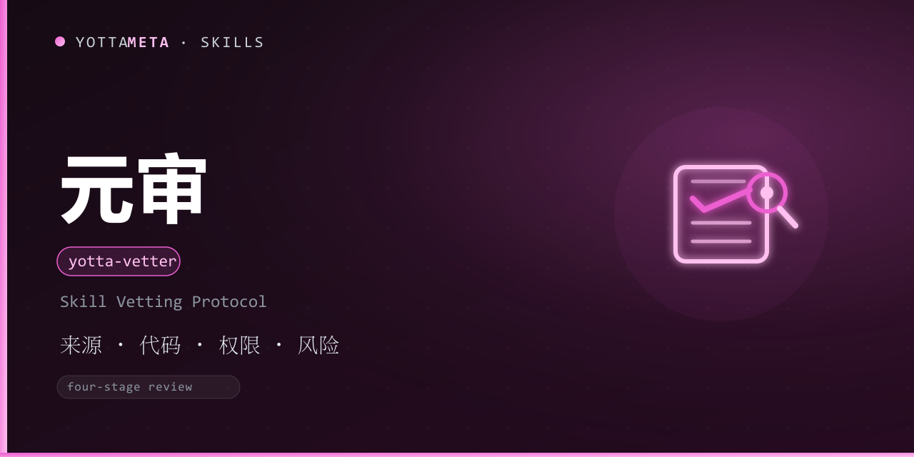

<p align="center"><b>Language</b>: English · <a href="./README.zh-CN.md">中文</a></p>

<p align="center">
  
</p>

<h1 align="center">yotta-vetter · 元审 (Yuanshen)</h1>

<p align="center">The "security review protocol" before installing any skill: <b>a four-phase checklist (source → code → permissions → risk) + a lightweight checker</b>, with deep-scan handoff to Yuan'an (yotta-security-audit). Use it whenever you fetch a skill from a marketplace, GitHub or any source and want to review it before installation.</p>
<p align="center">Activates before installing / evaluating any skill, when fetching a skill from a marketplace or GitHub, when reviewing a skill shared by someone else, or in any "about to install unknown code" scenario; also on 审查 / 审查技能 / vetting / 技能安全审查 / 检查技能 — <b>judged by whether unknown code is about to be installed, not keyword luck</b>.</p>
<p align="center">Python 3.8+ standard library, zero dependency; Windows + Linux; review and report only — the final decision requires human confirmation.</p>

<p align="center">
  <a href="LICENSE"></a>
  <a href="https://agentskills.io/"></a>
  <a href="https://www.npmjs.com/package/@yottameta/yotta-vetter"></a>
  <a href="https://github.com/YottaMeta/yotta-vetter"></a>
  <a href="https://github.com/YottaMeta/yotta-vetter/commits/main"></a>
  <a href="https://github.com/YottaMeta/yotta-vetter"></a>
</p>

## What it is

"Should I install this skill?" deserves a structured, traceable decision basis rather than a gut feeling. Yuanshen turns pre-install review into a four-phase checklist (source → code → permissions → risk) and uses a lightweight checker to scan for dangerous patterns and output a SKILL VETTING REPORT. It is not tied to any single platform: an agent-agnostic review protocol that works in any agent supporting Agent Skills — initial review and report only, never a substitute for the final decision.

## Core value

- **check** — four-phase initial review (source / code / permissions / risk) outputting a SKILL VETTING REPORT (verdict / decision record / timestamp / reviewer).
- **source** — semi-automated GitHub repo source check (stars / last updated / license) with a local cache; gracefully degrades offline.
- **Shared rules** — dangerous-pattern rules are shared with Yuan'an (scripts/vetter_rules.py is a synced copy of audit_rules.py).
- **Yuan'an handoff** — when the initial review finds high-and-above findings, it prints a one-line command guiding a Yuan'an deep scan.
- **Graded verdicts** — critical=DO NOT INSTALL; high=INSTALL WITH CAUTION; medium=REVIEW REQUIRED; low/info=SAFE TO INSTALL.

## Why use it

| Advantage | Description |
|---|---|
| **Four-phase structured** | source → code → permissions → risk, checked ring by ring, none skippable |
| **Traceable verdicts** | The report carries verdict / decision record / timestamp / reviewer — auditable |
| **Rules shared with Yuan'an** | vetter_rules.py is a synced copy of audit_rules.py; consistent criteria |
| **Semi-automated source** | source checks stars / last-updated / license with a local cache; degrades gracefully offline |
| **Deep-scan handoff** | high-and-above automatically guides you into yotta-security-audit |
| **Zero dependency** | Python 3.8+ standard library; no daemon / database; Windows + Linux |
| **Ecosystem distribution** | GitHub + npm synced; install via npx / install.sh / manual copy |

## Commands / four-phase review protocol

| Phase | Checkpoint | Command / reference |
|---|---|---|
| 1. Source | Source platform, author reputation, stars / last-updated, license | source github:owner/repo; references/checklist.md |
| 2. Code | SKILL.md integrity, script inventory, dangerous-pattern rule scan | check <path> |
| 3. Permissions | Executable bits, world-writable, symlinks, read/write/network scope | check <path> |
| 4. Risk | Risk-level verdict + conclusion + decision record | Verdict / decision-record sections of the report |

## Verdict matrix

| Risk level | Verdict | Action |
|---|---|---|
| critical | DO NOT INSTALL | Refuse installation and review manually |
| high | INSTALL WITH CAUTION | Decide after manual review |
| medium | REVIEW REQUIRED | Install after review |
| low/info | SAFE TO INSTALL | Still recommended to run the full protocol |

## Usage examples

```bash
# Initial review of a skill directory
python3 scripts/yotta_vetter.py check ./some-skill

# JSON output + generate a report file
python3 scripts/yotta_vetter.py check ./some-skill --json --report report.md

# Report only high and above
python3 scripts/yotta_vetter.py check ./some-skill --severity high

# Semi-automated source check (local cache; degrades gracefully offline)
python3 scripts/yotta_vetter.py source github:YottaMeta/yotta-memory
```

**Exit codes**: **0** = clean / low only; **1** = medium; **2** = high; **3** = critical; **4** = error.

## Division of labor with Yuan'an

- **Yuanshen** = initial review: fast and light — four-phase checklist + rule scan + source check.
- **Yuan'an** = deep scan: 13 detector classes + system security baseline.
- When Yuanshen finds high-and-above → it prints a command guiding a Yuan'an deep scan.

## Install

Pick any one of the three methods; skill files are fetched from **npm** (GitHub is slower without a proxy; npm can use a domestic mirror).

### Method 1: npm (recommended, one-liner)
```bash
# domestic mirror (optional): npm config set registry https://registry.npmmirror.com
npx -y @yottameta/yotta-vetter -g
npx -y @yottameta/yotta-vetter --dir <your-skills-dir>   # any agent: install to a specific directory
```
> Not in the preset list? Use --dir to point at the agent's skills directory, or manual copy (method 3). --list shows each agent's default directory. You can also npm pack @yottameta/yotta-vetter and unpack it to install via method 2 / 3.

### Method 2: install.sh one-shot
```bash
bash install.sh -g    # user level; bash install.sh --list shows all directories
bash install.sh --agent codex   # specific agent (--list shows available ones)
bash install.sh       # project level: auto-detect existing .claude/.cursor/.codex skills dirs
bash install.sh --dir /path/to/skills
```
> Covers 17 agent families including Trae / Qwen / Comate / CodeBuddy / Kimi. Windows users: works with Git Bash; otherwise use method 3.

### Method 3: manual copy
Copy the whole `yotta-vetter` folder into the target agent's skills directory. Common locations (user level; Windows uses %USERPROFILE%, Linux/macOS uses ~):

| Agent | User-level directory | Project-level directory |
|---|---|---|
| Codex | %USERPROFILE%\.codex\skills\yotta-vetter\ | .codex\skills\ |
| Claude Code | %USERPROFILE%\.claude\skills\yotta-vetter\ | .claude\skills\ |
| Cursor | %USERPROFILE%\.cursor\skills\yotta-vetter\ | .cursor\skills\ |
| Windsurf | %USERPROFILE%\.codeium\windsurf\skills\yotta-vetter\ | .windsurf\skills\ |
| opencode | %USERPROFILE%\.config\opencode\skills\yotta-vetter\ | .opencode\skills\ |
| Gemini | %USERPROFILE%\.gemini\skills\yotta-vetter\ | .gemini\skills\ |
| Goose | %USERPROFILE%\.config\goose\skills\yotta-vetter\ | .goose\skills\ |
| Amp | %USERPROFILE%\.config\agents\skills\yotta-vetter\ | .agents\skills\ |
| Kiro | %USERPROFILE%\.kiro\skills\yotta-vetter\ | .kiro\skills\ |
| WorkBuddy | %USERPROFILE%\.workbuddy\skills\yotta-vetter\ | .workbuddy\skills\ |
| Trae Code CLI | %USERPROFILE%\.traecli\skills\yotta-vetter\ | .traecli\skills\ |
| Trae IDE (CN) | %USERPROFILE%\.trae-cn\skills\yotta-vetter\ | .trae\skills\ |
| Qwen Code | %USERPROFILE%\.qwen\skills\yotta-vetter\ | .qwen\skills\ |
| Comate | %USERPROFILE%\.comate\skills\yotta-vetter\ | .comate\skills\ |
| CodeBuddy | %USERPROFILE%\.codebuddy\skills\yotta-vetter\ | .codebuddy\skills\ |
| Kimi | %USERPROFILE%\.kimi\skills\yotta-vetter\ | .kimi\skills\ |
| Generic AGENTS.md | %USERPROFILE%\.agents\skills\yotta-vetter\ | .agents\skills\ |

> If Codex's CODEX_HOME is set, it overrides the default; the same applies to opencode's XDG_CONFIG_HOME. .agents\skills is not a universal directory — only OpenCode / Cursor / Cline / Amp / Kimi / Gemini CLI / GitHub Copilot etc. read it; **Claude Code and Codex do not read it by default**. When unsure, use --dir or let the agent install it.

## Upgrade / uninstall

- **Upgrade**: reinstall the latest version to overwrite — npx -y @yottameta/yotta-vetter -g or rerun bash install.sh -g. Old files inside the skill folder are overwritten; other project files are untouched.
- **Uninstall**: delete the yotta-vetter folder under the target agent's skills directory (see the table above). The skill stops taking effect after removal.

## FAQ

- **Can Yuanshen decide for me?** No. The checker only does the initial review and report; the final verdict must be confirmed by a human.
- **What if high risk is found?** The report prints a guiding command to run Yuan'an (yotta-security-audit) for a deep scan; isolate or stop using the skill first, then review manually.
- **Does it work offline?** Yes. The GitHub API check in source degrades gracefully without network; check runs fully locally.
- **Will scanning itself false-positive?** Yuanshen's own source check uses the standard-library urllib to hit the GitHub API, so self-scan hits a network-call hint (medium) — expected behavior, not a risk.

## Related skills

Part of the YottaMeta skill matrix (security family): [yotta-security-audit](https://github.com/YottaMeta/yotta-security-audit) (Yuan'an, 13 detector classes + system security baseline) does the deep scan while Yuanshen does the pre-install review — high-and-above findings guide you into Yuan'an; [yotta-memory](https://github.com/YottaMeta/yotta-memory) (Yuanyi) handles cross-session long-term memory.

## Boundaries

- **Initial review & report only** — the checker never replaces the final decision; human confirmation is always required.
- **Authorized targets only** — source checks hit public GitHub metadata for explicitly named repos; no unauthorized scanning of others' systems.
- **Offline-capable** — everything except the GitHub source check works fully offline; that check degrades gracefully.

## Development & validation

- Run at the project root: python tools/validate-skill.py yotta-vetter
- Tests: python scripts/test_yotta_vetter.py (Windows: python)
- Details: references/checklist.md, references/vetting-report-template.md

Keep tests green and bump the version before releasing changes.

## Changelog

See [CHANGELOG.md](./CHANGELOG.md).

## License

[MIT](./LICENSE) © YottaMeta. "Yuanshen" / "yotta-vetter" and the YottaMeta family names (yotta-* prefix) are YottaMeta brand identifiers; derived works must not reuse them, see [NOTICE](./NOTICE). The review protocol references open-source skill-vetter style skills; the implementation is YottaMeta's own.
